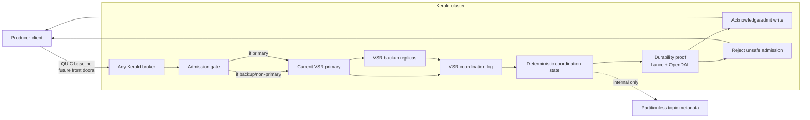
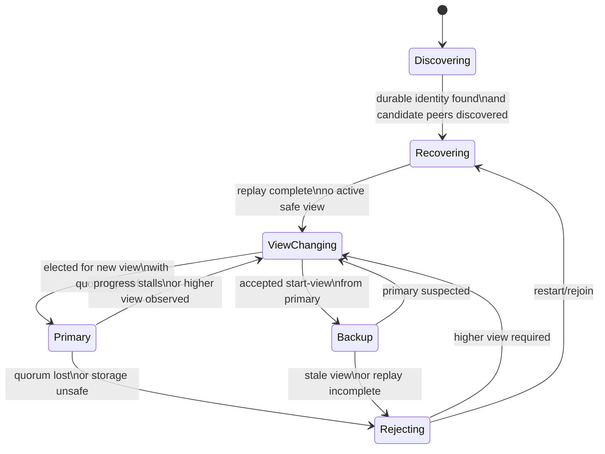
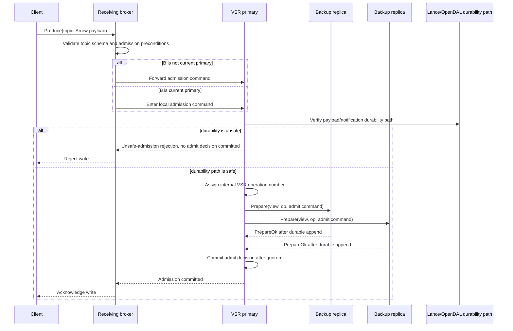
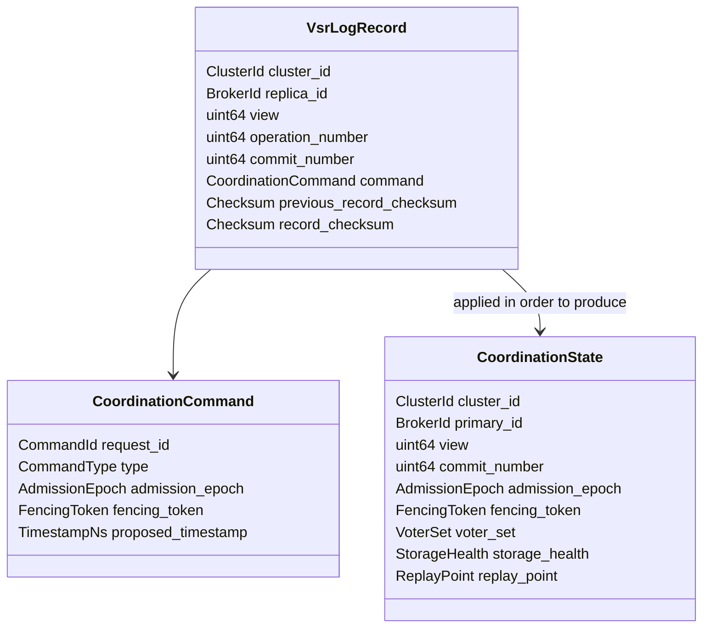
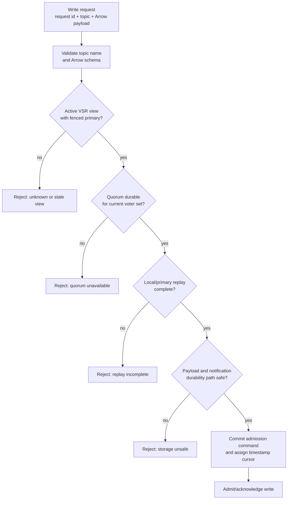

# Broker Coordination Architecture

Kerald clustered coordination uses TigerBeetle-style Viewstamped Replication (VSR) for control-plane agreement and safety-first write admission. This document describes the architecture shape selected by ADR 0002. It does not define the data-plane payload replication format or storage internals.

## Scope and invariants

VSR coordinates cluster control-plane state: the current view, primary identity, voter set, fencing epoch, admission epoch, topic metadata decisions, storage-health gates, and replay progress. Payloads remain Arrow values persisted through Lance read/write paths behind OpenDAL-backed storage. Brokers must not expose VSR operation numbers, commit positions, primary ownership, partitions, or offsets through client APIs.

Any broker may receive a producer request for a partitionless topic. A broker may acknowledge/admit the write only after the active VSR view can prove quorum health and the required payload/notification durability path is safe. If that proof is unavailable, ingress is rejected with an explicit unsafe-admission reason.

## Component schema

## Replica roles and state transitions

Roles:

- `Discovering`: finds candidate brokers through inter-broker communication. Discovery alone does not mutate voter membership.
- `Recovering`: reloads durable broker identity, VSR log, commit point, and coordination state.
- `ViewChanging`: exchanges durable log and commit metadata to establish a higher view safely.
- `Primary`: orders control-plane commands for the active view and commits after quorum acknowledgement.
- `Backup`: persists valid prepares from the active primary and rejects stale-view messages.
- `Rejecting`: process may be running, but write admission is unavailable until safety can be proven.

## Normal operation sequence

## Durable coordination log record schema

The `operation_number` and `commit_number` fields are internal replication coordinates. They must never become client-visible progress, cursor, delivery, or polling semantics. Client progress remains nanosecond timestamp based.

## Admission decision schema

Admission timestamp assignment must be deterministic and durable. The timestamp cursor is distinct from VSR operation numbers and remains the only client-visible progress coordinate.

## Membership and discovery

Inter-broker discovery finds candidate brokers; it does not silently add voters. Initial VSR bootstrap forms the voter set deterministically from durable broker UUIDs and the configured expected broker count. Membership changes after bootstrap require committed VSR reconfiguration records and a follow-up ADR before implementation.

Durable broker identity is required for VSR recovery. A broker UUID is generated automatically only on first initialization, persisted with the broker's data, and reused across restarts. A changed UUID represents a different replica and must not silently rejoin an existing voter set.

## Required observability

Production telemetry must include OTel logs, metrics, and traces for:

- current VSR view, primary identity, replica role, and voter-set identity;
- view-change count, duration, and reason;
- quorum availability transitions;
- stale-view and stale-primary rejection counts;
- prepare, commit, and admission latency;
- internal coordination replication lag and replay progress;
- unsafe-admission rejection counts by reason;
- storage-durability health used by admission decisions.

## Required validation coverage

- Unit tests: quorum math, view comparison, fencing token validation, durable identity reuse, voter-set bootstrap validation, admission-state transitions, and timestamp/operation-number separation.
- Integration tests: active view establishment, normal quorum commit path, stale-primary fencing, quorum loss, broker restart/replay, and non-primary write forwarding.
- Cucumber behavior tests: multi-node ingress rejection until VSR quorum/view is healthy, partitionless writes through any broker without exposing primary or partition concepts, and unsafe-admission rejection during quorum degradation.
- Performance tests: steady-state control-plane commit throughput, batching/pipelining latency, forwarded admission latency, failover blackout duration, replay/rejoin time, and CPU/memory/network overhead per committed command.
